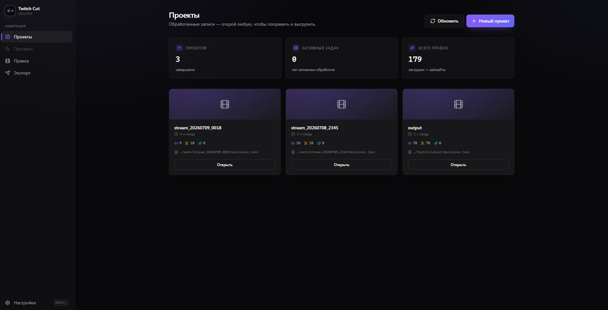
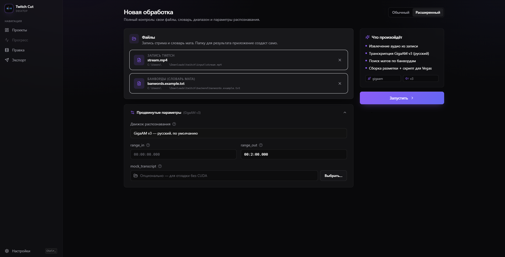
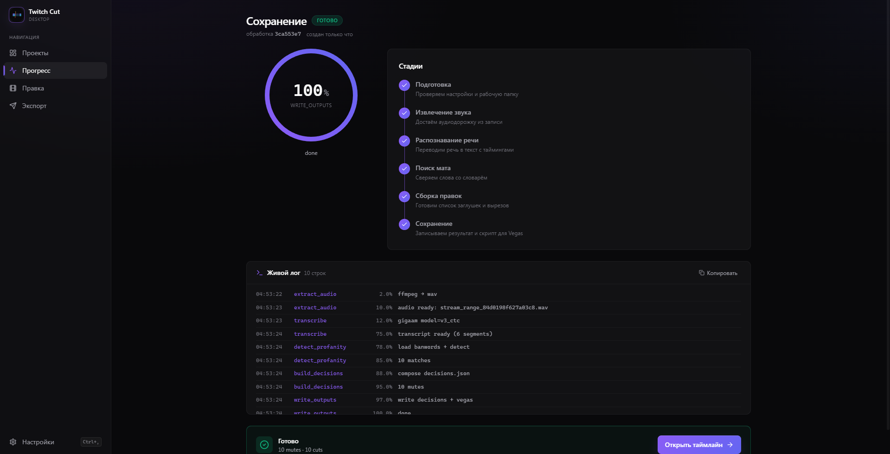
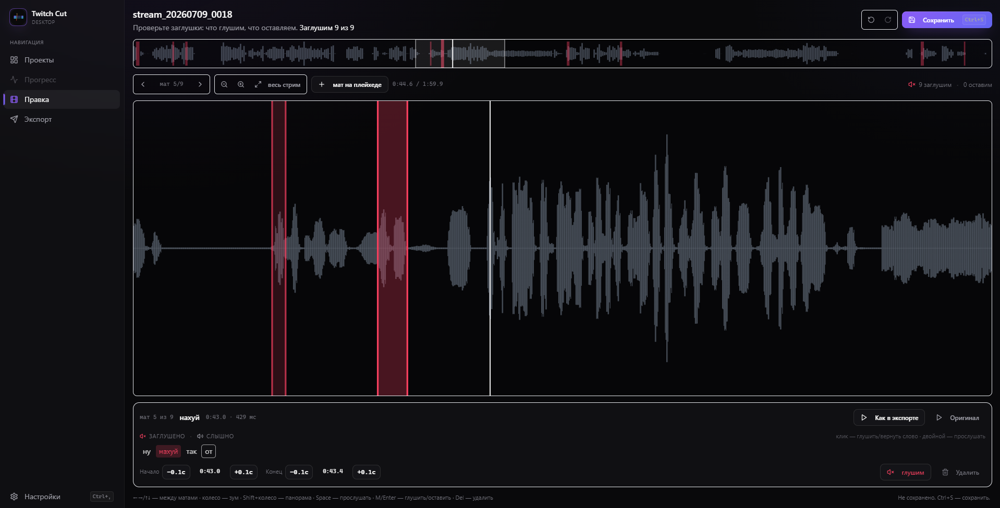

<div align="center">

# 🎬 Twitch Cut

**Десктоп-приложение, которое находит мат в Twitch-VOD и готовит разметку заглушек для монтажа в Vegas Pro 21.**

`stream.mp4` → **GigaAM v3** → mute-маркеры → **Vegas `.cs` скрипт**


[Что это](#-что-это) •
[Возможности](#-возможности) •
[Установка](#-установка) •
[Как пользоваться](#-как-пользоваться) •
[Как это работает](#-как-это-работает) •
[Стек](#-стек) •
[Поддержать](#-поддержать) •
[Лицензия](#-лицензия)

</div>






## 🎯 Что это

**Twitch Cut** — десктопное приложение (Electron + React) поверх Python-бэкенда. Оно берёт длинный Twitch-VOD, распознаёт речь через **GigaAM v3**, находит мат по словарю и выдаёт **редактируемые mute-решения** + скрипт для Vegas Pro 21, который расставит регионы и заглушит нужные куски.

Ничего не рендерит — только готовит монтажёру разметку. Ты остаёшься хозяином финального результата: каждую заглушку можно послушать, подвинуть границы, вернуть или удалить перед экспортом.

## ✨ Возможности

- 🎙️ **GigaAM v3 из коробки** — русский ASR, который точнее ловит мат и даёт узкие пословные тайминги. Не тянет хрупкий CTranslate2/cuDNN-стек.
- 🧠 **Умный поиск мата** — нормализация (`ё→е`, lowercase) + `pymorphy3`-лемматизация + fuzzy-мэтчинг по твоему `banwords.txt`.
- ✂️ **Точные заглушки по слову** — mute тянется ровно на слово-мат с padding ±80/120 мс, а не на всю фразу. Соседние маты склеиваются, чистая речь между ними не глушится.
- 🌊 **Таймлайн с waveform** — слушай каждую заглушку («как в экспорте» / «оригинал»), двигай границы на ±0.1 c, глуши/возвращай/удаляй слово.
- 📊 **Прозрачный прогресс** — этапы `извлечение → распознавание → поиск мата → сборка → сохранение` с живым логом.
- 🚀 **Один установщик** — при первом запуске сам скачает изолированный Python, зависимости (CUDA или CPU) и модели. Node.js/Python ставить не нужно.
- 🎞️ **Экспорт в Vegas Pro 21** — `decisions.json` (редактируемый) + `vegas_build.cs`: регионы и разрезанные, заглушённые аудио-события.
- 🔁 **Сменные движки** — если нужно, вместо GigaAM можно переключиться на WhisperX (PyTorch+CUDA) или whisper.cpp.

## 🚀 Установка
1. Открой **[Releases](https://github.com/arm4tura/twitch/releases)** и скачай последний `Twitch Cut Setup X.Y.Z.exe`.
2. Запусти установщик и пройди мастер (можно выбрать папку).
3. Запусти **Twitch Cut** из меню «Пуск».

При **первом запуске** приложение само подготовит всё необходимое (окно с прогрессом):

- скачает изолированный Python 3.12 (через `uv`) — системный Python **не нужен**;
- поставит зависимости: если найдена **NVIDIA GPU** — версию с CUDA (быстро), иначе **CPU-версию** (медленнее, но работает);
- скачает модели.

Это разовая процедура (~10–15 минут на быстром интернете). Node.js/`npm` пользователю **не нужны** — всё внутри приложения. Данные (venv, модели, логи) кладутся в writable-каталог рядом с приложением или в `%APPDATA%\Twitch Cut`.

> **Требования:** Windows 10/11 · ~10 GB свободного места. NVIDIA GPU + CUDA — **опционально** (ускоряет; без неё работает на CPU).

Если первый запуск упал — в окне есть кнопки **«Показать лог»** (`…\logs\bootstrap.log`) и **«Повторить»**.

<details>
<summary><b>Для разработчиков — запуск из исходников</b></summary>

> **Требования:** Python 3.10–3.12 · Node.js ≥ 18 · npm · (для GPU) NVIDIA + CUDA ≥ 12.6

**1. Backend (Python + ASR)**

```powershell
# Windows
git clone https://github.com/arm4tura/twitch.git twitch && cd twitch
powershell -ExecutionPolicy Bypass -File .\install.ps1
```

```bash
# Linux
git clone https://github.com/arm4tura/twitch.git twitch && cd twitch
bash ./install.sh
```

Скрипт проверит драйвер NVIDIA, создаст `backend/.venv`, поставит зависимости, запустит `doctor` и предложит скачать модели.

```powershell
# Проверка окружения
backend\.venv\Scripts\python -m twitch_cut.cli doctor
```

**2. Desktop UI (Electron)**

```bash
cd desktop
npm install
npm run dev          # Electron сам стартует twitch-cut serve из backend/.venv
```

**3. Сборка установщика**

```bash
cd desktop
npm run dist            # → desktop/release/Twitch Cut Setup X.Y.Z.exe
npm run dist:publish    # то же + заливка в GitHub Releases (нужен GH_TOKEN)
```

</details>

## 🕹 Как пользоваться

Установленное приложение запускается из меню «Пуск» (**Twitch Cut**). Дальше — прямо в UI:

1. **Новый проект** → выбери запись `stream.mp4` и словарь мата `banwords.txt`. В режиме «Расширенный» доступны движок распознавания, диапазон (`range_in` / `range_out`) и mock-транскрипт для отладки.
2. **Запусти** и следи за прогрессом: `извлечение звука → распознавание речи → поиск мата → сборка правок → сохранение`. Каждый этап кэшируется.
3. **Правка** — над waveform проверяешь заглушки: слушаешь («как в экспорте» / «оригинал»), двигаешь границы ±0.1 c, глушишь/возвращаешь/удаляешь. Горячие клавиши: `←/→` между матами, колесо — зум, `Space` — прослушать, `M/Enter` — глушить/оставить, `Del` — удалить.
4. **Экспорт** — пересобирает `output/vegas_build.cs` из текущего `decisions.json`.

Затем в **Vegas Pro 21**: `Tools → Scripting → Run Script…` → выбери `output/vegas_build.cs`. На таймлайне появятся регионы `MUTE profanity: …`, аудио-события будут разрезаны и заглушены на границах слова.

## 🧠 Как это работает

```
┌───────────┐   ffmpeg    ┌───────────┐   GigaAM v3   ┌────────────┐   export   ┌────────────────┐
│ stream.mp4├────────────►│   WAV     ├──────────────►│ transcript ├───────────►│ decisions.json │
└───────────┘  16k mono   └───────────┘  RU, word-ts  └─────┬──────┘            │ vegas_build.cs │
                                                            │  banwords.txt     └────────────────┘
                                                            ▼
                                                       profanity map
```

1. **Extract** — ffmpeg вырезает WAV 16 kHz mono для нужного диапазона.
2. **Transcribe** — GigaAM v3 (`v3_ctc`, RU) даёт «сырой» текст с пословными таймингами. `transcribe_longform` сам режет длинное аудио по VAD.
3. **Detect** — normalize (`ё→е`, lowercase) → `pymorphy3` лемматизация → matching по `banwords.txt`.
4. **Extend** — mute тянется точно по слову + padding, capped `mute_max_seconds`; соседние маты в пределах `mute_join_gap_ms` склеиваются.
5. **Export** — `decisions.json` (редактируемый) + `vegas_build.cs` для Vegas Pro 21.

Каждая стадия кэшируется в `work/<job>/cache/`. Пересчёт: `--force-extract` · `--force-transcribe` · `--force-detect`.

<details>
<summary><b>Альтернативные движки: WhisperX и whisper.cpp</b></summary>

По умолчанию используется **GigaAM v3**. При необходимости движок можно сменить:

- **WhisperX** (`--transcriber whisperx`) — faster-whisper через PyTorch+CUDA, `large-v3` + forced alignment. Anti-hallucination-профиль включён по умолчанию.
- **whisper.cpp** (`--transcriber whispercpp`) — если PyTorch+CUDA на Windows не поднимается. Свой CUDA-build, встроенный VAD, отдельный кэш:

```powershell
twitch-cut process ... `
  --transcriber whispercpp `
  --whisper-cpp-bin   "C:\tools\whisper.cpp\whisper-cli.exe" `
  --whisper-cpp-model "C:\tools\whisper.cpp\models\ggml-large-v3.bin"
```

</details>

## 🧱 Стек

| Слой | Технологии |
|------|-----------|
| **Desktop** | Electron 33 · React 18 · Vite 5 · TypeScript 5 · TailwindCSS · Radix UI · framer-motion · wavesurfer.js |
| **Backend** | Python 3.10–3.12 · Typer · FastAPI · uvicorn · WebSockets · ffmpeg |
| **ASR (default)** | GigaAM v3 (`v3_ctc`, Salute) |
| **ASR (alt)** | WhisperX `large-v3` · faster-whisper · CTranslate2 · pyannote.audio · whisper.cpp |
| **NLP** | pymorphy3 · rapidfuzz · RU banwords dictionary |
| **Export** | ScriptPortal.Vegas (`.cs` для Vegas Pro 21) |

<details>
<summary><b>Структура репозитория</b></summary>

```
twitch/
├─ backend/          # Python: CLI (twitch-cut) + FastAPI-сервер
│  ├─ src/twitch_cut/
│  ├─ tests/
│  └─ examples/      # mock transcript + smoke script
├─ desktop/          # Electron + React UI
│  ├─ electron/      # main / preload (Node-часть)
│  └─ src/           # renderer (React screens)
├─ input/            # 📥 stream.mp4 · original_video.mp4
├─ models/           # 🧠 кэш моделей ASR / VAD
├─ work/             # 🛠  cache · checkpoints
├─ output/           # 📤 decisions.json · vegas_build.cs
├─ install.ps1       # Windows one-liner (backend)
├─ install.sh        # Linux one-liner (backend)
├─ docs/             # 📚 скриншоты и материалы для README
├─ LICENSE           # MIT
└─ README.md
```

</details>

## ✅ Тесты

```powershell
cd backend && python -m pytest 
```

```bash
cd desktop && npm run typecheck
```

## 🙌 Credits

- [GigaAM](https://github.com/salute-developers/GigaAM) — русский ASR (Salute)
- [WhisperX](https://github.com/m-bain/whisperX) · [faster-whisper](https://github.com/SYSTRAN/faster-whisper) · [whisper.cpp](https://github.com/ggerganov/whisper.cpp)
- [pyannote.audio](https://github.com/pyannote/pyannote-audio) · [CTranslate2](https://github.com/OpenNMT/CTranslate2)
- [pymorphy3](https://github.com/no-plagiarism/pymorphy3) · [RapidFuzz](https://github.com/rapidfuzz/RapidFuzz)
- [Electron](https://www.electronjs.org/) · [React](https://react.dev/) · [Vite](https://vitejs.dev/) · [TailwindCSS](https://tailwindcss.com/) · [wavesurfer.js](https://wavesurfer.xyz/)
- [FastAPI](https://fastapi.tiangolo.com/) · [Typer](https://typer.tiangolo.com/)

## 📄 Лицензия

**MIT** — см. [`LICENSE`](./LICENSE). Используемые библиотеки распространяются под совместимыми лицензиями (MIT / BSD / Apache-2.0 / LGPL).

## 💖 Поддержать

<a href="https://www.donationalerts.com/r/arm4tura">
  
</a>

---
